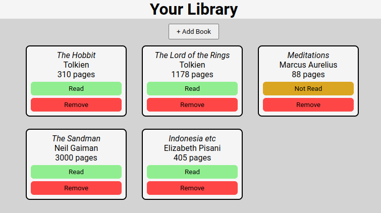

# full-stack-library
An in-browser interactive library

# Preview

    

# Links

-[Assignment Page (Jan '24)](https://www.theodinproject.com/lessons/node-path-javascript-library)

-[Finished Project](https://erreurdesyntaxe.github.io/full-stack-library)

# Notable Features

-Ability to add and remove books  
-Ability to mark book as read or not  

# Challenges

-A challenge followed by a double space  

# Lessons

-A lesson learned followed by a double space  

# Diary

Something to say
